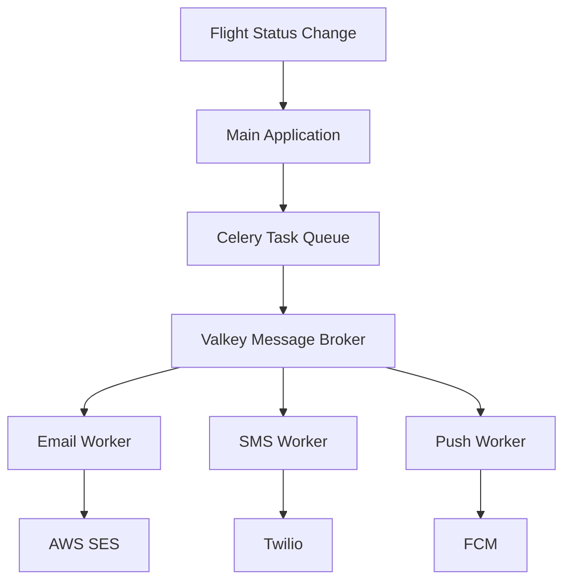

# Visual Assets Recommendations for Blog Post

## Suggested Diagrams and Images

### 1. Architecture Overview Diagram

```
┌─────────────────────────────────────────────────────────────┐
│                    Flight Notification System                 │
└─────────────────────────────────────────────────────────────┘

┌──────────────┐
│  Flight      │
│  Status      │──► Status Change (Delayed/Boarding/Cancelled)
│  Update      │
└──────┬───────┘
       │
       ▼
┌──────────────────────────────────────────────────────────────┐
│                      Main Application                          │
│                         (main.py)                              │
└──────────────────────────┬───────────────────────────────────┘
                           │
                           ▼
┌──────────────────────────────────────────────────────────────┐
│                  Celery Task Orchestrator                      │
│                   (notify_passengers)                          │
└───────┬────────────────┬─────────────────┬───────────────────┘
        │                │                 │
        ▼                ▼                 ▼
   ┌────────┐      ┌────────┐       ┌────────┐
   │ Email  │      │  SMS   │       │  Push  │
   │ Queue  │      │ Queue  │       │ Queue  │
   └───┬────┘      └───┬────┘       └───┬────┘
       │               │                 │
       ▼               ▼                 ▼
┌─────────────────────────────────────────────────────┐
│              Valkey/Redis Message Broker             │
│            (redis://localhost:6379/0)                │
└─────────────────────────────────────────────────────┘
       │               │                 │
       ▼               ▼                 ▼
   ┌────────┐      ┌────────┐       ┌────────┐
   │ Email  │      │  SMS   │       │  Push  │
   │ Worker │      │ Worker │       │ Worker │
   └───┬────┘      └───┬────┘       └───┬────┘
       │               │                 │
       ▼               ▼                 ▼
   ┌────────┐      ┌────────┐       ┌────────┐
   │  SES   │      │ Twilio │       │  FCM   │
   │  SMTP  │      │  SNS   │       │ APNS   │
   └────────┘      └────────┘       └────────┘
       │               │                 │
       ▼               ▼                 ▼
   📧 Email        💬 SMS            📱 Push
   Notification   Notification      Notification
```

**Tool Recommendations:** 
- Draw.io / Diagrams.net (free)
- Excalidraw (hand-drawn style)
- Lucidchart (professional)
- Mermaid (code-based, can embed in markdown)

---

### 2. Data Flow Sequence Diagram

```
User/System    Main App     Celery      Valkey      Workers      External APIs
    |             |           |           |            |              |
    |─Status─────>|           |           |            |              |
    |  Change     |           |           |            |              |
    |             |           |           |            |              |
    |             |─Create────>|          |            |              |
    |             | Tasks     |          |            |              |
    |             |           |          |            |              |
    |             |           |─Enqueue─>|            |              |
    |             |           |  Tasks   |            |              |
    |             |           |          |            |              |
    |             |           |          |─Deliver──>|              |
    |             |           |          |   Tasks   |              |
    |             |           |          |           |              |
    |             |           |          |           |─Call────────>|
    |             |           |          |           | (SES/Twilio) |
    |             |           |          |           |              |
    |             |           |          |           |<─Response────|
    |             |           |          |           |              |
    |             |           |          |<─Ack──────|              |
    |             |           |          |           |              |
    |             |<──Result──|<─────────|           |              |
    |<─Complete───|           |          |           |              |
```

**Tool Recommendations:**
- PlantUML (code-based)
- SequenceDiagram.org (online)
- Mermaid sequence diagrams

---

### 3. Pydantic Model Structure

```
┌─────────────────────────────────────────────┐
│              Flight Model                    │
├─────────────────────────────────────────────┤
│ + flight_number: str                         │
│ + airline: str                               │
│ + origin: str (IATA code)                    │
│ + destination: str (IATA code)               │
│ + scheduled_departure: datetime              │
│ + scheduled_arrival: datetime                │
│ + status: FlightStatus (enum)                │
│ + gate: Optional[str]                        │
│ + passengers: List[Passenger]                │
├─────────────────────────────────────────────┤
│ • Validates IATA codes (3 letters)           │
│ • Ensures arrival after departure            │
│ • Validates gate format                      │
└─────────────────────────────────────────────┘
                    │
                    │ 1 ──────── * 
                    ▼
┌─────────────────────────────────────────────┐
│            Passenger Model                   │
├─────────────────────────────────────────────┤
│ + passenger_id: str                          │
│ + first_name: str                            │
│ + last_name: str                             │
│ + email: EmailStr                            │
│ + phone_number: str                          │
│ + push_token: Optional[str]                  │
│ + preferred_notifications: List[...]         │
├─────────────────────────────────────────────┤
│ • Validates email format                     │
│ • Validates phone number pattern             │
│ • Auto-formats phone numbers                 │
└─────────────────────────────────────────────┘
```

---

### 4. Worker Queue Distribution

```
                    Passenger Preferences
                           │
        ┌──────────────────┼──────────────────┐
        │                  │                  │
   Email + SMS        Email Only         SMS + Push
        │                  │                  │
        ▼                  ▼                  ▼
┌────────────────┐  ┌────────────────┐  ┌────────────────┐
│  Email Queue   │  │  Email Queue   │  │   SMS Queue    │
│  SMS Queue     │  └────────────────┘  │   Push Queue   │
└────────────────┘                      └────────────────┘
        │                  │                  │
        ▼                  ▼                  ▼
   2 Tasks           1 Task             2 Tasks

Total: 5 tasks for 3 passengers with different preferences
```

---

### 5. Monitoring Dashboard (Flower Screenshot Mockup)

```
╔════════════════════════════════════════════════════════════╗
║  Flower - Celery Monitoring                    🌸 v2.0.1  ║
╠════════════════════════════════════════════════════════════╣
║                                                            ║
║  Workers: 3 online                     Tasks: 156 total   ║
║                                                            ║
║  ┌──────────────┐  ┌──────────────┐  ┌──────────────┐   ║
║  │ email_worker │  │  sms_worker  │  │ push_worker  │   ║
║  │   ✓ Online   │  │   ✓ Online   │  │   ✓ Online   │   ║
║  │   52 tasks   │  │   48 tasks   │  │   56 tasks   │   ║
║  └──────────────┘  └──────────────┘  └──────────────┘   ║
║                                                            ║
║  Tasks by Status:                                          ║
║  ████████████████████ SUCCESS: 148 (95%)                  ║
║  ██ FAILURE: 5 (3%)                                       ║
║  █ RETRY: 3 (2%)                                          ║
║                                                            ║
║  Queue Depth:                                              ║
║  email: 0    sms: 0    push: 0                           ║
║                                                            ║
╚════════════════════════════════════════════════════════════╝
```

---

### 6. Task Lifecycle Flowchart

```
        ┌─────────────┐
        │ Task Created│
        └──────┬──────┘
               │
               ▼
        ┌─────────────┐
        │  Serialized │
        │   to JSON   │
        └──────┬──────┘
               │
               ▼
        ┌─────────────┐
        │   Queued in │
        │   Valkey    │
        └──────┬──────┘
               │
               ▼
        ┌─────────────┐
        │   Worker    │
        │   Receives  │
        └──────┬──────┘
               │
        ┌──────┴──────┐
        │             │
        ▼             ▼
  ┌──────────┐  ┌──────────┐
  │ Success  │  │  Failure │
  └──────────┘  └────┬─────┘
                     │
              ┌──────┴──────┐
              │             │
              ▼             ▼
        ┌──────────┐  ┌──────────┐
        │  Retry   │  │ Max Retry│
        │          │  │ Reached  │
        └────┬─────┘  └──────────┘
             │              │
             └──────┬───────┘
                    │
                    ▼
             ┌──────────┐
             │   Done   │
             └──────────┘
```

---

### 7. Scale & Performance Visualization

```
                  Performance Metrics
                  
Throughput      │     
(tasks/sec)     │         ╱╲
                │        ╱  ╲    ← 3 Workers
           200  │       ╱    ╲
                │      ╱      ╲
           100  │     ╱        ╲╲  ← 1 Worker
                │    ╱          ╲╲
             0  │───────────────────────
                └───────────────────────── Time
                
Latency         │
(ms)            │ ╲                      
                │  ╲     ← 1 Worker
           200  │   ╲
                │    ╲
           100  │     ╲╲╲  ← 3 Workers
                │        ╲╲╲
             0  │───────────────────────
                └───────────────────────── Time
```

---

### 8. Production Architecture

```
                        ┌─────────────┐
                        │   Route 53  │
                        │     DNS     │
                        └──────┬──────┘
                               │
                        ┌──────▼──────┐
                        │     ALB     │
                        │ Load Balancer│
                        └──────┬──────┘
                               │
                ┌──────────────┼──────────────┐
                │              │              │
         ┌──────▼─────┐ ┌─────▼──────┐ ┌────▼──────┐
         │   ECS      │ │    ECS     │ │   ECS     │
         │  Cluster   │ │  Cluster   │ │  Cluster  │
         │  (Workers) │ │  (Workers) │ │ (Workers) │
         └──────┬─────┘ └─────┬──────┘ └────┬──────┘
                │              │              │
                └──────────────┼──────────────┘
                               │
                        ┌──────▼──────┐
                        │ ElastiCache │
                        │   (Valkey)  │
                        │   Cluster   │
                        └──────┬──────┘
                               │
                        ┌──────▼──────┐
                        │  CloudWatch │
                        │  Monitoring │
                        └─────────────┘
```

---

## Screenshot Recommendations

### 1. **Terminal Output**
- Capture the demo output from `python main.py`
- Show colorful task execution logs
- Display multiple terminal windows with workers

### 2. **Flower Dashboard**
- Tasks overview page
- Worker status page
- Task details with success/failure
- Real-time graph of task execution

### 3. **Code Snippets**
- Syntax-highlighted Pydantic models
- Celery task with decorators
- Docker compose output

### 4. **Docker Dashboard**
- Show all containers running
- Logs from different services

---

## Creating Diagrams

### Using Mermaid (Embeddable in Markdown)



### Using ASCII Art

Great for README files and inline documentation:
```
  Flight → App → Celery → Valkey → Workers → External APIs
```

---

## Color Scheme Suggestions

For consistency across all diagrams:

- **Valkey/Redis**: `#DC382D` (Redis red) or `#4DB8E8` (blue)
- **Celery**: `#37814A` (celery green)
- **Success**: `#28A745` (green)
- **Failure**: `#DC3545` (red)
- **Queued**: `#FFC107` (yellow/amber)
- **Processing**: `#17A2B8` (cyan)

---

## Image Asset Sources

### Free Stock Photos
- **Unsplash**: Airport, flight, notification themes
- **Pexels**: Technology, coding, cloud computing
- **Pixabay**: Similar to above

### Icon Resources
- **Font Awesome**: Email, SMS, push notification icons
- **Heroicons**: Modern UI icons
- **Material Icons**: Comprehensive icon set

### Recommended Cover Image Themes
1. Airport departure board with multiple flights
2. Smartphone notifications mockup
3. Abstract data flow visualization
4. Code editor with Python syntax
5. Cloud infrastructure diagram

---

## Tools for Creating Assets

### Diagramming
1. **Excalidraw** - Hand-drawn style, export PNG/SVG
2. **Draw.io** - Professional diagrams
3. **Mermaid** - Code-based, version controllable
4. **PlantUML** - Powerful text-based diagrams

### Screenshots
1. **Carbon** (carbon.now.sh) - Beautiful code screenshots
2. **Ray.so** - Similar to Carbon
3. **Snagit** - Professional screenshot tool
4. **ShareX** - Free Windows screenshot tool

### Video/GIF
1. **Asciinema** - Terminal recordings
2. **LICEcap** - Simple GIF recorder
3. **OBS Studio** - Full video recording

---

## Accessibility Considerations

When creating visual assets:

1. **Use high contrast colors**
2. **Add alt text to all images**
3. **Include text descriptions of diagrams**
4. **Ensure text is readable (min 14px)**
5. **Don't rely solely on color to convey information**

---

## Example Image Placements in Blog Post

1. **After Introduction**: Architecture overview diagram
2. **Before "Step 1"**: Project structure tree
3. **After "Step 2"**: Celery configuration diagram
4. **After "Step 5"**: Screenshot of demo running
5. **In "Monitoring" section**: Flower dashboard screenshot
6. **In "Production" section**: Production architecture diagram
7. **At end**: Call-to-action graphic

---

**Note:** All diagrams should be created in vector format (SVG) when possible for better quality at any size. Provide both light and dark mode versions if publishing on platforms with theme support.
